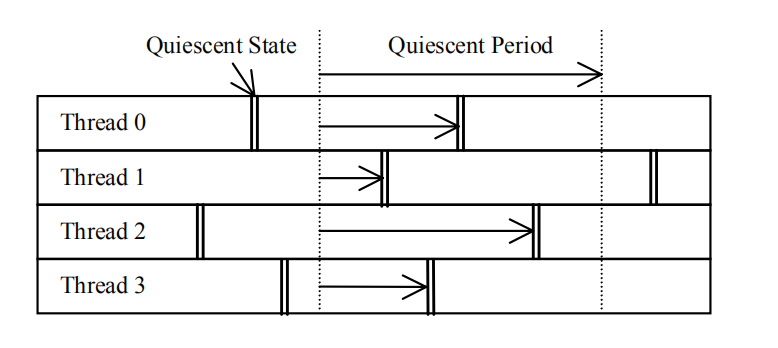
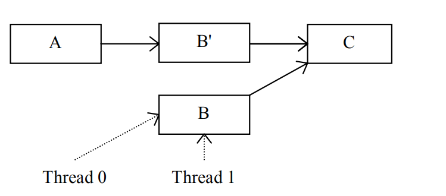
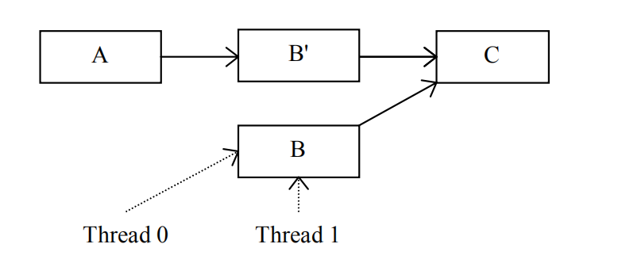
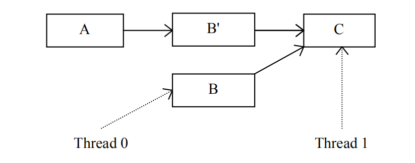
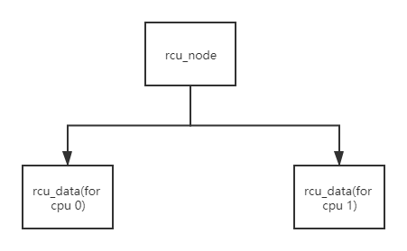
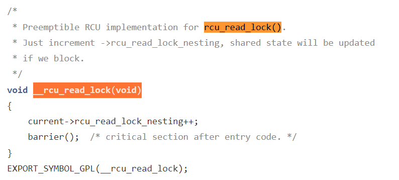

#  Read-Copy Update Mechanism on openEuler

As the increase in the speed of instruction execution of CPU cores is faster than latency reduction in the multi-core architecture, the overhead of global synchronization increases. In this case, the read-copy update (RCU) mechanism, a more efficient lock mechanism, is developed. The RCU mechanism is an asymmetric read-write synchronization mechanism for the data structure whose read access frequency is much higher than the write access frequency. The basic principle is to reduce the read access overhead at the cost of increasing the write access overhead, thereby reducing the overall overhead of frequent reads and few writes on data structures. In the RCU mechanism, no synchronization operation or lock is applied to a read operation, so that an update to a data structure does not block the read operation. This means that an old value may be read, which is allowed in the RCU mechanism.

To better understand the RCU mechanism, check the following basic concepts:

- Guarded data structure: a data structure protected by a synchronization mechanism such as a lock. Without protection of these mechanisms, the data structure cannot be securely accessed.

- Quiescent state: A thread in the quiescent state does not retain the prior state of any protected data structure.

- Quiescent period: During a quiescent period, each thread experiences at least one quiescent state.

  

  

The preceding figure shows the relationship between the quiescent state and the quiescent period. In the quiescent period, threads 1 to 4 experience a quiescent state each. Any period containing a quiescent state can be considered as a quiescent period. **The quiescent period ensures that any operation performed on a protected data structure before the quiescent period can be observed after the quiescent period.**

In the RCU mechanism, readers can read related data structures in lock-free mode. When a writer writes data to a related data structure, if a reader is reading data, the writer needs to copy the original data structure, update the copied data structure, and then replace the old data structure with the new data structure at a proper time. The proper time is the time when all readers exit. After the update is performed at this time, following readers can read the new data structure. So how to obtain the time when all readers exit? The quiescent period can be leveraged. If a thread has experienced a quiescent period recently, the thread does not retain the state of all the previous data structures. In this way, we can confirm that the read operation of the thread exits. In an OS, typical quiescent states are CPU idle, user program running, halting, and context switching. When in these states, threads stop accessing any kernel data structure.

Let's look at an example of the RCU mechanism. Assume that thread 0 is updating element B in the linked list, and thread 1 is traversing the linked list in lock-free mode.  


If thread 0 cannot perform an atomic update on element B, it cannot directly modify the value of element B with the interference of thread 1. According to the rules of the RCU mechanism, thread 0 first copies element B as B'.



After thread 0 updates the value of the element B copy, the next element of element A becomes B', but this does not affect thread 1 because the old value still exists in element B whose next element is still C. Then, thread 0 only needs to wait until thread 1 exit from element B to release element B.



Thread 0 waits for a quiescent period. When thread 1 stops accessing element B, thread 0 releases the space of element B.



After element B is released, the value of B in the linked list is replaced with the new value.


In the RCU mechanism, we need to know the end time of the quiescent period. A detection algorithm is required.

1. Any entity that needs to wait for a quiescent period registers the operations to be performed as callback functions after the quiescent period to the callback function linked list of the CPU.
2. After a period of time, the CPU notifies other CPUs that the quiescent period starts.
3. Each CPU that receives the notification saves a snapshot of the quiescent state counter. (In my understanding, this counter saves the number of CPUs that have experienced the quiescent state. That is, after a CPU experiences a quiescent state, the atomic operation of increasing the count by one is performed. In a quiescent period, a CPU can change the count only once.)
4. When each CPU finds that the snapshot value of the CPU is different from the current snapshot value of the quiescent state counter, it may be determined that a quiescent period has passed, and the last CPU that has passed the quiescent state records that a quiescent period has passed.
5. Each CPU calls the callback function registered in the callback function list after knowing that the new quiescent period ends.

In system design, an OS needs to support multiple CPUs, which requires good scalability of the RCU mechanism. The RCU tree is thereby developed. In a modern OS, **the quiescent period originally designed in the RCU mechanism is generally referred to as the grace period**. The core problem in the RCU mechanism is to determine when the quiescent period ends so that the callback function can be called at a proper time. In a large-scale multi-CPU system, recording the quiescent state of a CPU becomes more complex. In this case, the RCU tree can better solve this problem. The RCU tree has two key data structures: **rcu_node** and **rcu_data**. **rcu_data** is used to record the quiescent state of each CPU. It is a per-CPU data structure and is contained in leaf nodes of a tree constructed by **rcu_nodes**. **rcu_node** uploads quiescent state information of its child nodes to the root node and sends quiescent period information from the root node to the CPU. Once all child nodes of an **rcu_node** report the quiescent state information, the **rcu_node** reports the quiescent state information to its parent node. After receiving all the quiescent state reports, the root node delivers a notification indicating that the quiescent period ends to leaf nodes, so that the CPU may execute the callback function registered in the quiescent period or at an earlier time, for example, a callback function for destroying an object.

**rcu_node** is defined in the **kernel/rcu/tree.h** file.

```
/*
 * Definition for node within the RCU grace-period-detection hierarchy.
 */
struct rcu_node {
	raw_spinlock_t __private lock;	/* Root rcu_node's lock protects */
					/*  some rcu_state fields as well as */
					/*  following. */
	unsigned long gp_seq;	/* Track rsp->rcu_gp_seq. */
	unsigned long gp_seq_needed; /* Track rsp->rcu_gp_seq_needed. */
	unsigned long completedqs; /* All QSes done for this node. */
	unsigned long qsmask;	/* CPUs or groups that need to switch in */
				/*  order for current grace period to proceed.*/
				/*  In leaf rcu_node, each bit corresponds to */
				/*  an rcu_data structure, otherwise, each */
				/*  bit corresponds to a child rcu_node */
				/*  structure. */
	unsigned long rcu_gp_init_mask;	/* Mask of offline CPUs at GP init. */
	unsigned long qsmaskinit;
	……
				/*  Only one bit will be set in this mask. */
	int	grplo;		/* lowest-numbered CPU or group here. */
	int	grphi;		/* highest-numbered CPU or group here. */
	u8	grpnum;		/* CPU/group number for next level up. */
	u8	level;		/* root is at level 0. */
	bool	wait_blkd_tasks;/* Necessary to wait for blocked tasks to */
				/*  exit RCU read-side critical sections */
				/*  before propagating offline up the */
				/*  rcu_node tree? */
				bool	wait_blkd_tasks;/* Necessary to wait for blocked tasks to */
				/*  exit RCU read-side critical sections */
				/*  before propagating offline up the */
				/*  rcu_node tree? */
	struct rcu_node *parent;
	struct list_head blkd_tasks;
				/* Tasks blocked in RCU read-side critical */
				/*  section.  Tasks are placed at the head */
				/*  of this list and age towards the tail. */
	struct list_head *gp_tasks;
				/* Pointer to the first task blocking the */
				/*  current grace period, or NULL if there */
				/*  is no such task. */
	
				
	
	……
} ____cacheline_internodealigned_in_smp;
```

In the code block, **gp_seq** is the current quiescent period number of the current node. **qsmask** records quiescent states of child nodes of the node. If a bit is **1**, it indicates that the child node corresponding to the bit has not reported the quiescent period. **level** indicates the number of layers where the current **rcu_node** is located in the tree. The root node is at layer 0. The **parent** pointer points to the parent node of the current node. **blkd_tasks** is a list of blocked processes, which stores the processes that are preempted by other processes in the read-side critical section. **gp_tasks** points to the first process that blocks the current quiescent period.

The source code of **rcu_data** can also be found in the same file.

```
/* Per-CPU data for read-copy update. */
struct rcu_data {
	/* 1) quiescent-state and grace-period handling : */
	unsigned long	gp_seq;		/* Track rsp->rcu_gp_seq counter. */
	unsigned long	gp_seq_needed;	/* Track rsp->rcu_gp_seq_needed ctr. */
	unsigned long	rcu_qs_ctr_snap;/* Snapshot of rcu_qs_ctr to check */
					/*  for rcu_all_qs() invocations. */
	union rcu_noqs	cpu_no_qs;	/* No QSes yet for this CPU. */
	bool		core_needs_qs;	/* Core waits for quiesc state. */
	bool		beenonline;	/* CPU online at least once. */
	bool		gpwrap;		/* Possible ->gp_seq wrap. */
	struct rcu_node *mynode;	/* This CPU's leaf of hierarchy */
	unsigned long grpmask;		/* Mask to apply to leaf qsmask. */
	/* 2) batch handling */
	struct rcu_segcblist cblist;	/* Segmented callback list, with */
					/* different callbacks waiting for */
					/* different grace periods. */
    ......

	int cpu;
	struct rcu_state *rsp;
};
```

**gp_seq** is the current highest quiescent period number seen by the CPU. The **cpu_no_qs** structure records whether the CPU has experienced a quiescent state. The **core_need_qs** variable indicates that the RCU requires the CPU to report the quiescent state. **cblist** is the list of callback functions registered in the CPU. **cpu** is the ID of the current CPU. **rsp** points to a data structure **rcu_state** that maintains the RCU global state.

The rcu_read_lock(), rcu_read_unlock(), and synchronize_rcu() APIs are called for a read-copy update. The rcu_read_lock() function is used to enter the read-side critical section. The rcu_read_unlock() function is used to exit the read-side critical section. The synchronize_rcu() function is used to wait until the quiescent period ends.

For example, in the following code:  


Assume that CPU 0 runs rcu_reader() and CPU 1 runs rcu_update(). Then the RCU tree includes two **rcu_data** structures (corresponding to CPU 0 and CPU 1 respectively), and their parent node is an **rcu_node**.  



Ideally, CPU 1 sets **x** to **1** and calls synchronize_rcu() to wait until the quiescent period ends. synchronize_rcu() blocks processes in CPU 1 and causes context switching. As a result, CPU 1 enters the quiescent state and is recorded by **rcu_data**. CPU 0 enters the read-side critical section, reads the values of **x** and **y**, and then exits the read-side critical section. A subsequent context switch causes **rcu_data** of CPU 0 to record the quiescent state. In this way, the quiescent period of the system ends, and the rcu_update() function of CPU 1 sets the value of **y** to **1**.

The rcu_read_lock() function calls the _rcuread_lock() function. This function increases the number of nesting times in the read-side critical section by one. This design allows the RCU reader to be preempted by other processes in the read-side critical section and then migrated to another CPU to exit the read-side critical section. The source code of __rcu_read_lock() can be found in the **kernel/rcu/tree_plugin.h** file.



To enter the read-side critical section, only the number of nesting times of the read-side critical section needs to be increased. The process of exiting the read-side critical section is more complex, and the code is also in the **tree_plugin.h** file.  

```
/*
 * Preemptible RCU implementation for rcu_read_unlock().
 * Decrement ->rcu_read_lock_nesting.  If the result is zero (outermost
 * rcu_read_unlock()) and ->rcu_read_unlock_special is non-zero, then
 * invoke rcu_read_unlock_special() to clean up after a context switch
 * in an RCU read-side critical section and other special cases.
 */
void __rcu_read_unlock(void)
{
	struct task_struct *t = current;

	if (t->rcu_read_lock_nesting != 1) {
		--t->rcu_read_lock_nesting;
	} else {
		barrier();  /* critical section before exit code. */
		t->rcu_read_lock_nesting = INT_MIN;
		barrier();  /* assign before ->rcu_read_unlock_special load */
		if (unlikely(READ_ONCE(t->rcu_read_unlock_special.s)))
			rcu_read_unlock_special(t);
		barrier();  /* ->rcu_read_unlock_special load before assign */
		t->rcu_read_lock_nesting = 0;
	}
#ifdef CONFIG_PROVE_LOCKING
	{
		int rrln = READ_ONCE(t->rcu_read_lock_nesting);

		WARN_ON_ONCE(rrln < 0 && rrln > INT_MIN / 2);
	}
#endif /* #ifdef CONFIG_PROVE_LOCKING */
}
EXPORT_SYMBOL_GPL(__rcu_read_unlock);
```

If the number of nesting times is not **1**, it indicates that the process is not the last process that exits the read-side critical section, and the number of nesting times is simply decreased by one. Otherwise, the number of nesting times is set to a negative number. In this way, if the current process is preempted by another process, the latter realizes that the current process is exiting the outermost layer of the read-side critical section and allows it to execute the remaining part of the read-side critical section. The preempted process calls the rcu_read_unlock_special() function to delete itself from the blocking process list of **rcu_node**, and the last process that exits the outermost layer of the read-side critical area sets the number of nesting times to **0**.

The source code of **synchronize_rcu()** is also in the **tree_plugin.h** file.

```
/**
 * synchronize_rcu - wait until a grace period has elapsed.
 *
 * Control will return to the caller some time after a full grace
 * period has elapsed, in other words after all currently executing RCU
 * read-side critical sections have completed.  Note, however, that
 * upon return from synchronize_rcu(), the caller might well be executing
 * concurrently with new RCU read-side critical sections that began while
 * synchronize_rcu() was waiting.  RCU read-side critical sections are
 * delimited by rcu_read_lock() and rcu_read_unlock(), and may be nested.
 *
 * See the description of synchronize_sched() for more detailed
 * information on memory-ordering guarantees.  However, please note
 * that -only- the memory-ordering guarantees apply.  For example,
 * synchronize_rcu() is -not- guaranteed to wait on things like code
 * protected by preempt_disable(), instead, synchronize_rcu() is -only-
 * guaranteed to wait on RCU read-side critical sections, that is, sections
 * of code protected by rcu_read_lock().
 */
void synchronize_rcu(void)
{
	RCU_LOCKDEP_WARN(lock_is_held(&rcu_bh_lock_map) ||
			 lock_is_held(&rcu_lock_map) ||
			 lock_is_held(&rcu_sched_lock_map),
			 "Illegal synchronize_rcu() in RCU read-side critical section");
	if (rcu_scheduler_active == RCU_SCHEDULER_INACTIVE)
		return;
	if (rcu_gp_is_expedited())
		synchronize_rcu_expedited();
	else
		wait_rcu_gp(call_rcu);
}
EXPORT_SYMBOL_GPL(synchronize_rcu);
```

This function is used to wait for the end of the quiescent period. It calls the wait_rcu_gp() function, which calls the wake_me_after_rcu() function to wait for all readers to exit the critical section. After all readers exit the critical section, wake_me_after_rcu() wakes up the wait_rcu_gp() function, and then the synchronize_rcu() function returns to the caller.

How to determine that the quiescent period ends? In an RCU tree, when a CPU experiences a quiescent state, the quiescent state information needs to be reported to an upper layer. The current quiescent period ends only after all members of the root node report the quiescent state. During the reporting process, the clock interrupt function calls the rcu_check_callbacks() function whose code is in the **kernel/rcu/tree.c** file.

```
/*
 * Check to see if this CPU is in a non-context-switch quiescent state
 * (user mode or idle loop for rcu, non-softirq execution for rcu_bh).
 * Also schedule RCU core processing.
 *
 * This function must be called from hardirq context.  It is normally
 * invoked from the scheduling-clock interrupt.
 */
void rcu_check_callbacks(int user)
{
	trace_rcu_utilization(TPS("Start scheduler-tick"));
	increment_cpu_stall_ticks();
	if (user || rcu_is_cpu_rrupt_from_idle()) {

		/*
		 * Get here if this CPU took its interrupt from user
		 * mode or from the idle loop, and if this is not a
		 * nested interrupt.  In this case, the CPU is in
		 * a quiescent state, so note it.
		 *
		 * No memory barrier is required here because both
		 * rcu_sched_qs() and rcu_bh_qs() reference only CPU-local
		 * variables that other CPUs neither access nor modify,
		 * at least not while the corresponding CPU is online.
		 */

		rcu_sched_qs();
		rcu_bh_qs();
		rcu_note_voluntary_context_switch(current);

	} else if (!in_softirq()) {

		/*
		 * Get here if this CPU did not take its interrupt from
		 * softirq, in other words, if it is not interrupting
		 * a rcu_bh read-side critical section.  This is an _bh
		 * critical section, so note it.
		 */

		rcu_bh_qs();
	}
	rcu_preempt_check_callbacks();
	/* The load-acquire pairs with the store-release setting to true. */
	if (smp_load_acquire(this_cpu_ptr(&rcu_dynticks.rcu_urgent_qs))) {
		/* Idle and userspace execution already are quiescent states. */
		if (!rcu_is_cpu_rrupt_from_idle() && !user) {
			set_tsk_need_resched(current);
			set_preempt_need_resched();
		}
		__this_cpu_write(rcu_dynticks.rcu_urgent_qs, false);
	}
	if (rcu_pending())
		invoke_rcu_core();

	trace_rcu_utilization(TPS("End scheduler-tick"));
}


```

This function first checks whether the CPU experiences a non-context switch quiescent state, such as user mode or idle loop. If yes, it calls the rcu_sched_qs() function to record the quiescent state in **rcu_data** corresponding to the CPU. Otherwise, it checks whether the interrupt is triggered in the software interrupt. If not, it calls the rcu_bh_qs() function to record the quiescent state. Then the rcu_preempt_check_callbacks() function is called to call rcu_preempt_qs() for quiescent state information recording. Finally, the rcu_pending() function is called to check whether there are RCU-related tasks to be processed. If yes, the invoke_rcu_core() function is called. Its source code is in the same file.

```
static void invoke_rcu_core(void)
{
	if (cpu_online(smp_processor_id()))
		raise_softirq(RCU_SOFTIRQ);
}
```

This function triggers an RCU software interrupt. The function for processing the software interrupt is rcu_process_call_backs(). If the CPU has an interrupt, preemption, or bottom-half mechanism enabled, the rcu_process_call_backs() function is called, which starts the callback function processing mechanism in the current quiescent period. The source code of the rcu_process_call_backs() function can be found in the **kernel/rcu/tree.c** file.

```
/*
 * Do RCU core processing for the current CPU.
 */
static __latent_entropy void rcu_process_callbacks(struct softirq_action *unused)
{
	struct rcu_state *rsp;

	if (cpu_is_offline(smp_processor_id()))
		return;
	trace_rcu_utilization(TPS("Start RCU core"));
	for_each_rcu_flavor(rsp)
		__rcu_process_callbacks(rsp);
	trace_rcu_utilization(TPS("End RCU core"));
}
```

This function calls the __rcu_process_callbacks() function, and its source code can be found in the same file.

```
/*
 * This does the RCU core processing work for the specified rcu_state
 * and rcu_data structures.  This may be called only from the CPU to
 * whom the rdp belongs.
 */
static void
__rcu_process_callbacks(struct rcu_state *rsp)
{
	unsigned long flags;
	struct rcu_data *rdp = raw_cpu_ptr(rsp->rda);
	struct rcu_node *rnp = rdp->mynode;

	WARN_ON_ONCE(!rdp->beenonline);

	/* Update RCU state based on any recent quiescent states. */
	rcu_check_quiescent_state(rsp, rdp);

	/* No grace period and unregistered callbacks? */
	if (!rcu_gp_in_progress(rsp) &&
	    rcu_segcblist_is_enabled(&rdp->cblist)) {
		local_irq_save(flags);
		if (!rcu_segcblist_restempty(&rdp->cblist, RCU_NEXT_READY_TAIL))
			rcu_accelerate_cbs_unlocked(rsp, rnp, rdp);
		local_irq_restore(flags);
	}

	rcu_check_gp_start_stall(rsp, rnp, rdp);

	/* If there are callbacks ready, invoke them. */
	if (rcu_segcblist_ready_cbs(&rdp->cblist))
		invoke_rcu_callbacks(rsp, rdp);

	/* Do any needed deferred wakeups of rcuo kthreads. */
	do_nocb_deferred_wakeup(rdp);
}
```

__rcu_process_callbacks() first calls rcu_check_quiescent_state() to check whether a new grace period starts or whether the CPU has experienced a quiescent state. The source code of rcu_check_quiescent_state() can be found in the same file.

```
/*
 * Check to see if there is a new grace period of which this CPU
 * is not yet aware, and if so, set up local rcu_data state for it.
 * Otherwise, see if this CPU has just passed through its first
 * quiescent state for this grace period, and record that fact if so.
 */
static void
rcu_check_quiescent_state(struct rcu_state *rsp, struct rcu_data *rdp)
{
	/* Check for grace-period ends and beginnings. */
	note_gp_changes(rsp, rdp);

	/*
	 * Does this CPU still need to do its part for current grace period?
	 * If no, return and let the other CPUs do their part as well.
	 */
	if (!rdp->core_needs_qs)
		return;

	/*
	 * Was there a quiescent state since the beginning of the grace
	 * period? If no, then exit and wait for the next call.
	 */
	if (rdp->cpu_no_qs.b.norm)
		return;

	/*
	 * Tell RCU we are done (but rcu_report_qs_rdp() will be the
	 * judge of that).
	 */
	rcu_report_qs_rdp(rdp->cpu, rsp, rdp);
}
```

If the CPU experiences a quiescent state, the rcu_check_quiescent_state() function calls the rcu_report_qs_rdp() function to record the quiescent state in **rcu_data** of the CPU. After the state of the CPU is updated, the __rcu_process_callbacks() function calls the invoke_rcu_callbacks() function to process callback functions registered before the current quiescent period ends. The source code of invoke_rcu_callbacks is also in the **tree.c** file.

```
/*
 * Schedule RCU callback invocation.  If the specified type of RCU
 * does not support RCU priority boosting, just do a direct call,
 * otherwise wake up the per-CPU kernel kthread.  Note that because we
 * are running on the current CPU with softirqs disabled, the
 * rcu_cpu_kthread_task cannot disappear out from under us.
 */
static void invoke_rcu_callbacks(struct rcu_state *rsp, struct rcu_data *rdp)
{
	if (unlikely(!READ_ONCE(rcu_scheduler_fully_active)))
		return;
	if (likely(!rsp->boost)) {
		rcu_do_batch(rsp, rdp);
		return;
	}
	invoke_rcu_callbacks_kthread();
}
```

If the CPU supports RCU priority boosting, the rcu_do_batch() function is directly called to process the callback functions. Otherwise, the per-CPU kthread is woken up to process the callback functions. The source code of the rcu_do_batch() function is also in the **tree.c** file.

```
/*
 * Invoke any RCU callbacks that have made it to the end of their grace
 * period.  Thottle as specified by rdp->blimit.
 */
static void rcu_do_batch(struct rcu_state *rsp, struct rcu_data *rdp)
{
	unsigned long flags;
	struct rcu_head *rhp;
	struct rcu_cblist rcl = RCU_CBLIST_INITIALIZER(rcl);
	long bl, count;

	/* If no callbacks are ready, just return. */
	if (!rcu_segcblist_ready_cbs(&rdp->cblist)) {
		trace_rcu_batch_start(rsp->name,
				      rcu_segcblist_n_lazy_cbs(&rdp->cblist),
				      rcu_segcblist_n_cbs(&rdp->cblist), 0);
		trace_rcu_batch_end(rsp->name, 0,
				    !rcu_segcblist_empty(&rdp->cblist),
				    need_resched(), is_idle_task(current),
				    rcu_is_callbacks_kthread());
		return;
	}

	/*
	 * Extract the list of ready callbacks, disabling to prevent
	 * races with call_rcu() from interrupt handlers.  Leave the
	 * callback counts, as rcu_barrier() needs to be conservative.
	 */
	local_irq_save(flags);
	WARN_ON_ONCE(cpu_is_offline(smp_processor_id()));
	bl = rdp->blimit;
	trace_rcu_batch_start(rsp->name, rcu_segcblist_n_lazy_cbs(&rdp->cblist),
			      rcu_segcblist_n_cbs(&rdp->cblist), bl);
	rcu_segcblist_extract_done_cbs(&rdp->cblist, &rcl);
	local_irq_restore(flags);

	/* Invoke callbacks. */
	rhp = rcu_cblist_dequeue(&rcl);
	for (; rhp; rhp = rcu_cblist_dequeue(&rcl)) {
		debug_rcu_head_unqueue(rhp);
		if (__rcu_reclaim(rsp->name, rhp))
			rcu_cblist_dequeued_lazy(&rcl);
		/*
		 * Stop only if limit reached and CPU has something to do.
		 * Note: The rcl structure counts down from zero.
		 */
		if (-rcl.len >= bl &&
		    (need_resched() ||
		     (!is_idle_task(current) && !rcu_is_callbacks_kthread())))
			break;
	}

	local_irq_save(flags);
	count = -rcl.len;
	trace_rcu_batch_end(rsp->name, count, !!rcl.head, need_resched(),
			    is_idle_task(current), rcu_is_callbacks_kthread());

	/* Update counts and requeue any remaining callbacks. */
	rcu_segcblist_insert_done_cbs(&rdp->cblist, &rcl);
	smp_mb(); /* List handling before counting for rcu_barrier(). */
	rcu_segcblist_insert_count(&rdp->cblist, &rcl);

	/* Reinstate batch limit if we have worked down the excess. */
	count = rcu_segcblist_n_cbs(&rdp->cblist);
	if (rdp->blimit == LONG_MAX && count <= qlowmark)
		rdp->blimit = blimit;

	/* Reset ->qlen_last_fqs_check trigger if enough CBs have drained. */
	if (count == 0 && rdp->qlen_last_fqs_check != 0) {
		rdp->qlen_last_fqs_check = 0;
		rdp->n_force_qs_snap = rsp->n_force_qs;
	} else if (count < rdp->qlen_last_fqs_check - qhimark)
		rdp->qlen_last_fqs_check = count;

	/*
	 * The following usually indicates a double call_rcu().  To track
	 * this down, try building with CONFIG_DEBUG_OBJECTS_RCU_HEAD=y.
	 */
	WARN_ON_ONCE(rcu_segcblist_empty(&rdp->cblist) != (count == 0));

	local_irq_restore(flags);

	/* Re-invoke RCU core processing if there are callbacks remaining. */
	if (rcu_segcblist_ready_cbs(&rdp->cblist))
		invoke_rcu_core();
}
```

This function traverses the prepared callback function list, executes the functions, and calls the invoke_rcu_core() function to process the remaining callback functions. The invoke_rcu_core() function directly triggers the RCU software interrupt.

```
static void invoke_rcu_core(void)
{
	if (cpu_online(smp_processor_id()))
		raise_softirq(RCU_SOFTIRQ);
}
```

On the other hand, the invoke_rcu_callbacks_kthread() function is used to wake up the per-CPU kthread. Its source code can be found in the **kernel/rcu/tree_plugin.h** file.

```
/*
 * Wake up the per-CPU kthread to invoke RCU callbacks.
 */
static void invoke_rcu_callbacks_kthread(void)
{
	unsigned long flags;

	local_irq_save(flags);
	__this_cpu_write(rcu_cpu_has_work, 1);
	if (__this_cpu_read(rcu_cpu_kthread_task) != NULL &&
	    current != __this_cpu_read(rcu_cpu_kthread_task)) {
		rcu_wake_cond(__this_cpu_read(rcu_cpu_kthread_task),
			      __this_cpu_read(rcu_cpu_kthread_status));
	}
	local_irq_restore(flags);
}
```

So far, we have learned some basic knowledge related to RCU on openEuler, including the RCU basic principle, RCU usage, RCU-related data structures, RCU quiescent state monitoring and reporting mechanism, and callback function processing mechanism.

------

References

[1] Mckenney, P. E., & Slingwine, J. D. (1998). Read-copy upcategory: blog 
date: Using execution history to solve concurrency problems. Parallel and Distributed Computing and Systems. 

[2] Liang L., Mckenney, P. E., Kroening D., et al. Verification of tree-based hierarchical read-copy update in the Linux kernel [C]. Design, Automation and Test in Europe Conference and Exhibition. 0. 

[3] Yu Huabing. (2019). In-depth Analysis of Linux Kernel.