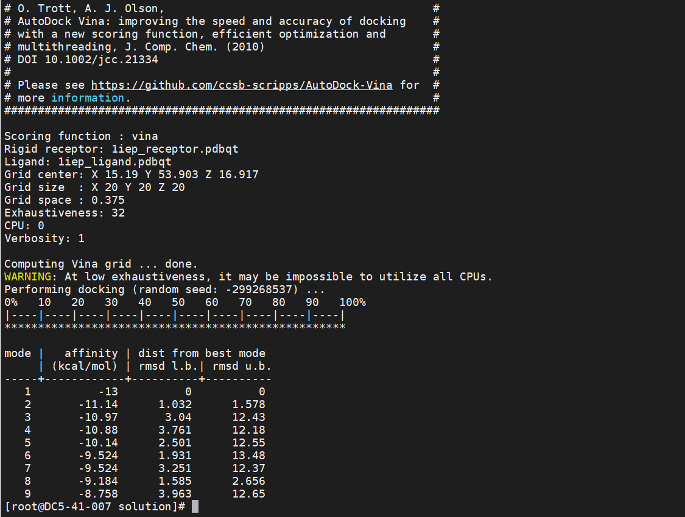
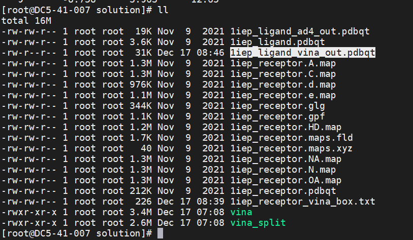

# 1.**软件介绍**

AutoDockvina是一款做分子对接的开源程序。它由Oleg Trott博士在Scripps研究所的分子图形实验室设计和实现的。与AutoDock相比，Vina大大提高了准确性，此外，Vina可以利用系统上的多个CPU或CPU内核来显著缩短运行时间。

关于AutoDockvina的更多信息请访问: https://vina.scripps.edu/。

语言：C++

一句话描述：是一款开源的分子模拟软件。

开源协议：Apache License 2.0

# 2.**环境要求**

## 2.1. 硬件要求如下表：

| 项目   | 说明                |
| ---- | ----------------- |
| CPU  | Kunpeng 920       |
| 内存大小 | 32GB 2666MHz * 16 |
| 网卡   | 1*10GE            |

## 2.2. 软件要求如下表：

| 项目            | 版本    | 下载地址                                                                                 |
| ------------- | ----- | ------------------------------------------------------------------------------------ |
| AutoDock vina | 1.2.3 | https://github.com/ccsb-scripps/AutoDock-Vina/archive/refs/tags/v1.2.3.tar.gz        |
| 毕昇编译器         | 2.1.0 | https://www.hikunpeng.com/zh/developer/devkit/compiler/bisheng                       |
| Boost         | 1.78  | https://boostorg.jfrog.io/artifactory/main/release/1.78.0/source/boost_1_78_0.tar.gz |

## 2.3. 操作系统要求如下表：

| 项目        | 版本                  | 下载地址                                                |
| --------- | ------------------- | --------------------------------------------------- |
| openEuler | openEuler 20.03 SP3 | https://repo.openeuler.org/openEuler-20.03-LTS-SP3/ |
| Kernel    | 4.19.90             | https://gitee.com/openeuler/kernel                  |

# 3.**移植规划**

AutoDockvina软件在移植过程中涉及到的相关软件安装规划路径的用途及详细说明：

| 序号  | 软件安装规划路径                                                                   | 用途                   | 说明                                                                                  |
| --- | -------------------------------------------------------------------------- | -------------------- | ----------------------------------------------------------------------------------- |
| 1   | /usr/local/bisheng                                                         | 毕昇编译器的安装规划路径。        | 这里的安装规划路径只是一个举例说明，建议部署在共享路径中。需要根据实际情况调整，后续章节凡是遇到安装路径的命令，都以现网实际规划的安装路径为准进行替换，不再单独说明。 |
| 2   | /usr/local/boost1.78                                                       | boost的安装规划路径。        |                                                                                     |
| 3   | /usr/local/AutoDockVina/                                                   | AutoDock vina安装规划路径。 |                                                                                     |
| 4   | /usr/local/AutoDockvina/AutoDock-Vina-1.2.3/example/basic_docking/solution | AutoDock vina测试规划路径。 |                                                                                     |

# 4.**配置编译环境**

前提条件：使用SFTP工具将各安装包上传至服务器对应目录下。

配置流程：

| 序号  | 配置项        | 说明               |
| --- | ---------- | ---------------- |
| 1   | 搭建鲲鹏基座软件环境 | 参考4.1 搭建鲲鹏基座软件环境 |
| 2   | 安装依赖       | 参考4.2 安装依赖环境     |
| 3   | 安装boost    | 参考4.3安装boost。    |

## 4.1 **搭建鲲鹏基座软件**

### 4.1.1 **yum源安装方式**

**步骤1**    在/etc/yum.repos.d/目录下增加配置文件bisheng-compiler.repo：

    cat > /etc/yum.repos.d/bisheng-compiler.repo << EOF
    
    [bisheng-compiler]
    
    name=bisheng-compiler
    
    baseurl=https://repo.oepkgs.net/bisheng/aarch64/
    
    enabled=1
    
    gpgcheck=0
    
    priority=100
    
    EOF

**步骤2**    从yum源下载和安装毕昇编译器rpm包：

    yum update
    yum install bisheng-compiler -y

**步骤3**  （可选）清空当前窗口的hash表。

如果系统中有其他版本的 LLVM 编译器，请在安装毕昇编译器之后立即运行：

    hash -r

防止clang命令被hash捕获，出现毕昇编译器或开源LLVM编译器无法使用的问题。

**步骤4**    验证安装是否成功。

安装完毕后执行如下命令验证毕昇编译器版本：

    clang -v

若返回结果已包含bisheng compiler版本信息，说明安装成功。

### 4.1.2 **软件包安装方式**

**步骤 1**  准备工作。

在毕昇编译器产品页选择“[毕昇编译器软件包下载](https://mirrors.huaweicloud.com/kunpeng/archive/compiler/bisheng_compiler/BiSheng-compiler-2.5.0-aarch64-linux.tar.gz)”获取毕昇编译器软件包并且上传至服务器上。

软件包下载页面：https://www.hikunpeng.com/zh/developer/devkit/compiler/bisheng

**步骤 2**  安装毕昇编译器环境依赖项：

    yum install -y gcc glibc libatomic bc tar

**步骤 3**  创建毕昇编译器安装目录:

    mkdir -p /usr/local/bisheng

**注意：**/usr/local/为举例说明路径，请根据用例存放实际路径修改。

**步骤4**  下载毕昇编译器压缩包并解压：

    cd /usr/local/bisheng
    wget https://mirrors.huaweicloud.com/kunpeng/archive/compiler/bisheng_compiler/bisheng-compiler-2.1.0-aarch64-linux.tar.gz --no-check-certificate
    tar -zxvf bisheng-compiler-2.1.0-aarch64-linux.tar.gz

解压完成后在当前目录下出现名为“bisheng-compiler-2.1.0-aarch64-linux”的目录。

**步骤 5** 安装environment-modules工具：

    yum install environment-modules -y
    source /etc/profile

**步骤6** 创建环境变量配置文件：

    vi /usr/local/bisheng/bisheng_modulefiles

新增如下内容：

    #%Module1.0
    conflict bisheng
    prepend-path PATH /usr/local/bisheng/bisheng-compiler-2.1.0-aarch64-linux/bin
    prepend-path LD_LIBRARY_PATH /usr/local/bisheng/bisheng-compiler-2.1.0-aarch64-linux/lib

**步骤7** 在当前shell中加载环境变量：

    module use /usr/local/bisheng/
    module load /usr/local/bisheng/bisheng_modulefiles

**注意**：若要避免每打开一个shell就要导入一次变量的情况，建议可将环境变量写入到系统配置文件中(可选)：

    vi /etc/profile

新增如下内容：

    module use /usr/local/bisheng/
    module load /usr/local/bisheng/bisheng_modulefiles

**步骤 8**使环境变量生效。

    source /etc/profile

**步骤 9** 清空当前窗口的hash表(可选)。

如果系统中有其他版本的 LLVM 编译器，请在安装毕昇编译器之后立即运行如下命令：

    hash -r

防止clang命令被hash捕获，出现毕昇编译器或开源LLVM编译器无法使用的问题。

**步骤 10** 验证安装是否成功。

安装完毕后执行如下命令验证毕昇编译器版本：

    clang -v

若返回结果已包含bisheng compiler版本信息，说明安装成功。

----结束

## **4.2 安装依赖**

**步骤1**：yum安装依赖包:

    yum install -y libstdc++-static

## **4.3 安装boost**

**步骤 1** 使用PuTTY工具，以root用户登录服务器。
**步骤 2** 创建按装包下载目录和安装目录：

    mkdir -p /hpc/boost/
    mkdir -p /usr/local/boost1.78

**步骤 3**  进入安装目录：

    cd /hpc/boost/

**步骤 4**  运行以下命令下载源码包：

    wget https://boostorg.jfrog.io/artifactory/main/release/1.78.0/source/boost_1_78_0.tar.gz

**步骤 5**  解压安装包：

    tar -zxvf boost_1_78_0.tar.gz

**步骤 6**  进入解压后的目录，并安装libicu 和libicu-devel：

    cd boost_1_78_0
    yum install -y libicu libicu-devel

**步骤 7**  编译boost:

    ./bootstrap.sh --with-toolset=clang
    ./b2 toolset=clang cxxflags="-std=c++11"
    ./b2 --prefix=/usr/local/boost1.78 install

**注意**：/usr/local/boost1.78为举例说明路径，请根据用例存放实际路径修改。

**步骤 8**  运行以下命令，创建环境变量配置文件：

    vi /usr/local/boost1.78/boost_modulefiles

新增如下内容：

    #%Module1.0
    conflict boost
    prepend-path PATH /usr/local/boost1.78/bin.v2
    prepend-path LD_LIBRARY_PATH /usr/local/boost1.78/libs

**步骤 9** 执行以下命令，在当前shell中加载环境变量：

    module use /usr/local/boost1.78/
    module load /usr/local/boost1.78/boost_modulefiles

**步骤 10**  若要避免每打开一个shell就要导入一次变量的情况，建议可将配置写入到系统配置文件中：

    vi /etc/profile

新增如下内容：

    module use /usr/local/boost1.78/
    module load /usr/local/boost1.78/boost_modulefiles

使配置生效：

    source /etc/profile

# 5.**获取源码**

**步骤 1** 下载AutoDockvina安装包“v1.2.3.tar.gz”。

下载地址：https://github.com/shenwei356/seqkit/archive/refs/tags/v2.2.0.tar.gz

---结束。

# 6.**编译和安装**

**步骤 1**  使用PuTTY工具，以root用户登录服务器。
**步骤 2**  安装依赖包：

    yum install gcc-c++ swig -y

**步骤 3**  创建软件包下载及安装目录:：

    mkdir -p /usr/local/AutoDockVina

**步骤 4**  进入下载目录

    cd /usr/local/AutoDockVina

**步骤 5**  下载软件包：

    wget https://github.com/ccsb-scripps/AutoDock-Vina/archive/refs/tags/v1.2.3.tar.gz

**步骤 6**  解压软件包：

**注意** 请以实际软件压缩包名称为准。

    tar -zxvf v1.2.3.tar.gz

**步骤 7**  进入Autodock vina安装路径：

    cd /usr/local/AutoDockVina/AutoDock-Vina-1.2.3/build/linux/release/

**步骤 8**  修改makefile：

    vi Makefile

修改：

    BASE=/usr/local/boost1.78
    BOOST_VERSION=1.78
    GPP= /usr/local/bisheng/bisheng-compiler-2.1.0-aarch64-linux/bin/clang++

**步骤 9**  编译：

    make -j

**步骤 10**创建环境变量配置文件：

    vi /usr/local/AutoDockVina/AutoDock-Vina-1.2.3/AutoDock-Vina-1.2.3_modulefiles

新增如下内容：

    #%Module1.0
    conflict AutoDockvina
    prepend-path PATH /usr/local/AutoDockVina/AutoDock-Vina-1.2.3/build/linux/release
    prepend-path LD_LIBRARY_PATH /usr/local/AutoDockVina/AutoDock-Vina-1.2.3/src/lib

执行以下命令，在当前shell中加载环境变量：

    module use /usr/local/AutoDockVina/AutoDock-Vina-1.2.3/build/linux/release
    module load /usr/local/AutoDockVina/AutoDock-Vina-1.2.3/AutoDock-Vina-1.2.3_modulefiles

新增如下内容：

    module use /usr/local/seqkit/seqkit
    module load /usr/local/seqkit/seqkit/seqkit_modulefiles

**步骤 11**  若要避免每打开一个shell就要导入一次变量的情况，建议可将配置写入到系统配置文件中：

    vi /etc/profile

新增如下内容：

    module use /usr/local/AutoDockVina/AutoDock-Vina-1.2.3/build/linux/release
    module load /usr/local/AutoDockVina/AutoDock-Vina-1.2.3/AutoDock-Vina-1.2.3_modulefiles

使配置生效：

    source /etc/profile

----结束

# 7.**运行和验证**

**步骤 1**  使用PuTTY工具，以root用户登录服务器。

**步骤 2**  修改测试配置文件1iep_receptor_vina_box.txt:

    cd /usr/local/AutoDockvina/AutoDock-Vina-1.2.3/example/basic_docking/solution
    vi 1iep_receptor_vina_box.txt

添加如下四行：

    exhanstiveness = 32
    cpu = 0
    energy_range = 4
    num_modes = 9

具体参数解释：

**步骤 3**  查看对接所使用的的文件是否都在运行路径下：

**步骤 4**  运行命令：

    vina --receptor 1iep_receptor.pdbqt --ligand 1iep_ligand.pdbqt  \--config 1iep_receptor_vina_box.txt \--exhaustiveness=32 --out 1iep_ligand_vina_out.pdbqt

如出现运行完成结果(运行完成截图)并且查看生成1iep_ligand_vina_out.pdbqt文件(输出文件截图)说明vina 对接完成：

运行完成截图：

输出文件截图：

----结束。

# 8.**修订记录**

| 发布日期       | 修订记录     |
| ---------- | -------- |
| 2023-02-09 | 第一次正式发布。 |
