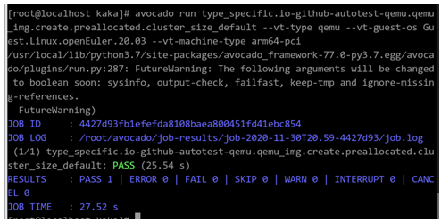

#  简介 

  本文以openeuler版本为例，介绍虚拟化框架avocado-vt的部署及应用，指导用户开展虚拟化组件测试。

  为了更好地理解整个应用过程，我们需要首先了解以下基本概念：

- Avocado：Avocado是一套帮助自动化测试的工具和库，源于autotest，最主要的优势包括可以多种形式的结果呈现、提供了多个实用的程序模块、可通过插件扩展等；
  
  更多信息可参见官方指导[https://avocado-framework.readthedocs.io/en/latest/index.html](https://avocado-framework.readthedocs.io/en/latest/index.html)

- Avocado-VT：Avocado-VT是一个虚拟化测试插件，提供与虚拟化测试相关的原子，并提供Avocado提供的所有便利；
  
  更多信息可参见官方指导[https://avocado-vt.readthedocs.io/en/latest/index.html](https://avocado-vt.readthedocs.io/en/latest/index.html)
 
- Tp（test-providers）：主要是提供组件测试用例集，当前openEuler上已有tp-libvirt/tp-qemu；

  
#  测试部署环境准备

- 基础rpm包安装

  虚拟化组件包安装，qemu、libvirt、edk2等
  
  框架依赖包，git、gcc、python3-pip、python3-devel、tcpdump、nc、diffutils、iputils等
  
- pip3源配置

  avocado/avocado-vt部署时，需要通过pip3安装python第三方库，如果不配置，则通过pip3从python官方库获取第三方库。基于用户实际网络情况，选择配置pip3，可一定程度上提升下载的速率及稳定性。
  
  使用如下命令可配置，如配置tsinghua的源
  
  ```
  pip3 config set global.index-url https://pypi.tuna.tsinghua.edu.cn/simple
  ```
  
- 其他配置

  基于用户的实际网络环境，如果测试环境有做相关的网络隔离，根据实际情况选择是否配置代理，包括git配置http/https代理、网络配置http/https代理

#  测试安装部署

- 源码下载

  依次下载框架及用例集代码并切换到对应分支，其中branch当前支持openEuler-20.03
  
  ```
  git clone $url
  git checkout -f $branch
  ```
  
  包含以下几个仓库：

  [https://gitee.com/src-openeuler/avocado](https://gitee.com/src-openeuler/avocado)

  [https://gitee.com/openeuler/avocado-vt](https://gitee.com/openeuler/avocado-vt)

  [https://gitee.com/openeuler/tp-libvirt](https://gitee.com/openeuler/tp-libvirt)

  [https://gitee.com/openeuler/tp-qemu](https://gitee.com/openeuler/tp-qemu)

- avocado安装

  依赖包安装：pip3 install -r requirements-selftests.txt
  
  avocado框架安装： python3 setup.py install

- avacado-vt安装
  
  配置test-providers：配置libvirt、qemu
  
  依赖包安装：pip3 install -r requirements.txt
  
  avocado-vt插件安装： python3 setup.py install

- 用例集引导
  
  引导tp-libvirt、tp-qemu用例集 
  
  ```
  avocado vt-bootstrap --vt-type qemu --vt-skip-verify-download-assets --yes-to-all
  avocado vt-bootstrap --vt-type libvirt --vt-skip-verify-download-assets --yes-to-all
  ```

以上的部署过程总结成如下代码：
```
install_virttest() {
    local branch=$1

    cd "$srcdir/tp-qemu"
    git checkout -f "$branch"

    cd "$srcdir/tp-libvirt"
    git checkout -f "$branch"

    cd "$srcdir/avocado"
    git checkout -f "$branch"
    sed -i "s/^libvirt-python/#&/" requirements-selftests.txt
    pip3 install -r requirements-selftests.txt
    python3 setup.py install

    cd "$srcdir/avocado-vt"
    git checkout -f "$branch"
    sed -i "/^branch: /d" test-providers.d/io-github-autotest-qemu.ini
    sed -i "/^uri: /c uri: $srcdir/tp-qemu" test-providers.d/io-github-autotest-qemu.ini
    sed -i "/^uri: /a branch: $branch" test-providers.d/io-github-autotest-qemu.ini
    sed -i "/^branch: /d" test-providers.d/io-github-autotest-libvirt.ini
    sed -i "/^uri: /c uri: $srcdir/tp-libvirt" test-providers.d/io-github-autotest-libvirt.ini
    sed -i "/^uri: /a branch: $branch" test-providers.d/io-github-autotest-libvirt.ini
    rm -f test-providers.d/io-github-spiceqa-spice.ini
    pip3 install -r requirements.txt
    python3 setup.py install

    avocado vt-bootstrap --vt-type qemu --vt-skip-verify-download-assets --yes-to-all
    avocado vt-bootstrap --vt-type libvirt --vt-skip-verify-download-assets --yes-to-all
}
```  

#  测试执行准备

- 虚拟机xml

  需要提前准备好libvirt的xml，并在执行tp-libvirt相关用例前先define
  
- 测试虚拟机镜像准备

  镜像的命名要求、支持镜像的范围，可参见配置/var/lib/avocado/data/avocado-vt/backends/libvirt/cfg/guestos-os.cfg
  
  镜像存放路径为/var/lib/avocado/data/avocado-vt/images/，所在磁盘分区空间需要足够大，在用例执行过程中会先备份一下镜像，故此空间至少是镜像大小两倍以上。多机场景的用例，会通过virt-clone等方式克隆多份镜像，尤其需要注意镜像所在磁盘分区空间的大小
  
- libvirt配置

  设置/etc/libvirt/qemu.conf下user/group字段，配置为root

- 测试框架的base配置

  基础配置，包含了虚拟机名称、镜像名称、镜像登录用户密码等。如果涉及迁移双机场景，需要配置迁移环境的配置信息。
  
  ```
  /var/lib/avocado/data/avocado-vt/backends/libvirt/cfg/base.cfg
  /var/lib/avocado/data/avocado-vt/backends/libvirt/cfg/guest-os.cfg
  ```

#  测试执行及结果分析

- 用例查看

  在用例执行之前，先通过avocado list查看对应模块的用例，可同时用于检测框架部署的正确性。
  
  如下几条命令，分别可查看qemu、libvirt以及通过多个条件组合过滤后的qemu_img模块的用例集。如果不做过滤用例集较大，命令执行稍微耗时多点（1分钟内）
  
  ```
  avocado list --vt-type qemu --vt-machine-type arm64-pci
  avocado list --vt-type libvirt --vt-machine-type arm64-pci 
  avocado list qemu_img --vt-type qemu --vt-no-filter non-preallocated --vt-only-filter cluster_size_default --vt-machine-type arm64-pci
  ```

- qemu用例执行

  qemu用例可直接执行，不依赖libvirt的配置以及使用libvirt事先define一个虚拟机
  
  示例：
  
  ```
  avocado run type_specific.io-github-autotest-qemu.qemu_img.create.preallocated.cluster_size_default --vt-type qemu --vt-guest-os Guest.Linux.openEuler.20.03 --vt-machine-type arm64-pci
  ```
    

- libvirt用例执行

  libvirt用例执行之前，确保libvirt服务启动状态，同时需要基于前一章节中准备的虚拟机xml和镜像define一个测试虚拟机
  
  示例：
  ```
  avocado list virsh.reset --vt-type libvirt --vt-no-filter acl_test --vt-only-filter uuid_options --vt-machine-type arm64-pci
  ```

- 结果定位

  框架执行的每个用例的日志，都会归档在logs_dir = ~/avocado/job-results下（具体可配置avocado.conf中logs_dir字段）。
  
  参考前面qemu用例的执行示例图，可以看到日志的归档，关注JOB LOG文件 ，可以基于此开展失败分析定位。
