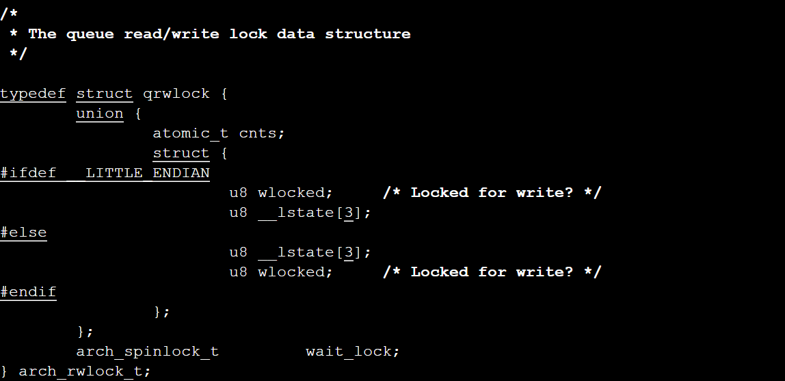
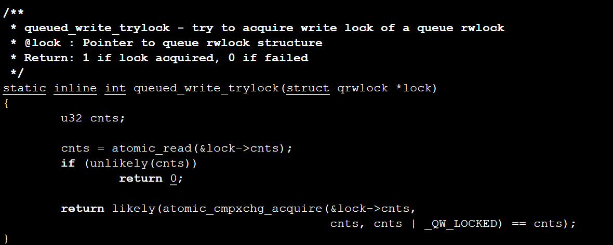

# openEuler中的排队读写锁

同一个线程组中的线程共享了数据结构mm_struct和vm_area_struct，从而实现对内存的共享。然而，当两个线程同时需要访问同一块被共享的内存时，会出现竞争，也就是说两个线程访问该内存的顺序可能不确定，从而导致程序的输出结果不确定。为了保证线程访问共享变量的顺序是程序员期望的，我们需要线程间通信的机制，常用的线程间通信机制有锁和信号量。锁和信号量机制可以用于保证同一时间只有一个线程进入访问某一共有资源的程序片段，这样的程序片段被称为临界区。openEuler中的锁有自旋锁和互斥锁。本期我们介绍自旋锁，包含排队自旋锁和排队读写锁。

自旋锁用于保护较短的临界区，在临界区内不允许睡眠。自旋锁的定义代码在include/linux/spinlock_types.h文件中可以找到：


这段代码封装了另一个结构体raw_spinlock,其定义代码在同一个文件中可以找到：


arch_spinlock_t这个类型对于单处理器和SMP情形的定义是不同的，对于单处理器类型它的定义在spinlock_types_up.h这个文件中，而对于SMP情形则在spinlock_types.h文件中：


对于单处理器情形，arch_spinlock_t类型被定义为空：


对于SMP的情形，我们在arch/arm64/include/asm/spinlock_types.h文件中可以看到其定义包含在两个文件中：


在qspinlock_types.h文件中我们可以找到arch_spinlock_t的定义：

```
typedef struct qspinlock {
        union {
                atomic_t val;

                /*
                 * By using the whole 2nd least significant byte for the
                 * pending bit, we can allow better optimization of the lock
                 * acquisition for the pending bit holder.
                 */

#ifdef __LITTLE_ENDIAN
                struct {
                        u8      locked;
                        u8      pending;
                };
                struct {
                        u16     locked_pending;
                        u16     tail;
                };
#else
                struct {
                        u16     tail;
                        u16     locked_pending;
                };
                struct {
                        u8      reserved[2];
                        u8      pending;
                        u8      locked;

                };

#endif
        };
} arch_spinlock_t;
```

其中locked位表示锁的状态，该位为1表示锁不可获取，为0则表示锁可以获取；pending是未决位，该位为1时表示至少有一个线程在等待锁，该位为0时表示要么锁被持有但没有争用，要么等待队列已经存在[2]。

这两个文件中分为定义了排队自旋锁和排队读写锁，读写锁是自旋锁的改进，自旋锁在同一时刻只允许一个线程进入临界区，而读写锁则允许多个读者并发地访问临界区，但只允许一个写者在同一时刻访问临界区（也就是说写者和写者、读者和写者之间是互斥的，但读者和读者之间可以并发）。排队指的是使用队列算法来管理多个希望持有锁的线程，在openEuler中使用的是FIFO算法来管理排队等待的线程。排队自旋锁在参考文献[2]中已有详细介绍，本文主要介绍排队读写锁。

排队读写锁的定义代码在include/asm-generic/qrwlock_types.h 文件中可以找到：



其中cnts原子变量的低9位用来标识该队列读写锁是否有写者持有，将该变量右移九位则表示持有该队列读写锁的读者数量。同时，我们可以看到该读写锁中还定义了一个排队自旋锁wait_lock。为了更好地理解这段代码，我们首先来了解一下openEuler中的原子变量和其操作。原子变量可以用来实现对整数变量的互斥访问，对原子变量的原子操作是不可分割的。原子变量用atomic_t类型标识，对原子变量常用的操作有[1]：

- atomic_read(v):读取原子变量的值；
- atomic_add_return(i,v):把原子变量v的值加上i并返回新值；
- atomic_sub_return(i,v):把原子变量v的值减去i,并且返回新值；
- atomic_cmpxchg(v,old,new):如果原子变量v的值等于old，那么将v的值设置为new，并返回旧值；

在openEuler中，include/linux/atomic.h文件中定义了一系列原子操作，如atomic_add_return_aquire:


atomic_cmpxchg_aquire:


使用这些原子操作，可以对队列读写锁中的cnts变量进行操作，例如在include/asm-generic/qrwlock.h 文件中的queued_read_trylock（）函数中，首先使用atomic_read（）函数读出原子变量cnts的值，如果没有写者持有该锁，则增加持有该锁的读者数量并返回1，否则维持读者数量不变并返回0：


其中有关的定义值的定义如下：


因此cnts & QW_WMASK用来检查是否有写者占有锁，而使用_QR_BIAS对cnts进行原子加则可以用cnts的高位对读者数量进行计数。再考察一下queued_write_trylock()函数：



该函数通过判断cnts变量是否为0来判断是否有读者或写者已经占有该读写锁，如果已经占有，则抢锁失败；如果锁没有被读者或写者占有，则将cnts的低八位置为0xff,表示锁已经被写者持有。

再来看看queued_read_lock()函数，该函数在确认没有写者占有希望抢占的锁时调用queued__read_lock_slow_path()函数：


该函数的代码在./kernel/locking/qrwlock.c文件中可以找到：

```
/**

 * queued_read_lock_slowpath - acquire read lock of a queue rwlock

 * @lock: Pointer to queue rwlock structure
 */
   void queued_read_lock_slowpath(struct qrwlock *lock)
   {
       /*
        * Readers come here when they cannot get the lock without waiting
        */
       if (unlikely(in_interrupt())) {
               /*
                * Readers in interrupt context will get the lock immediately
                * if the writer is just waiting (not holding the lock yet),
                * so spin with ACQUIRE semantics until the lock is available
                * without waiting in the queue.
                */
               atomic_cond_read_acquire(&lock->cnts, !(VAL & _QW_LOCKED));
               return;
       }
       atomic_sub(_QR_BIAS, &lock->cnts);

       /*
        * Put the reader into the wait queue
        */
               arch_spin_lock(&lock->wait_lock);
               atomic_add(_QR_BIAS, &lock->cnts);
       
               /*
                * The ACQUIRE semantics of the following spinning code ensure
                * that accesses can't leak upwards out of our subsequent critical
                * section in the case that the lock is currently held for write.
                */
               atomic_cond_read_acquire(&lock->cnts, !(VAL & _QW_LOCKED));
       
               /*
                * Signal the next one in queue to become queue head
                */
               arch_spin_unlock(&lock->wait_lock);
       }
       EXPORT_SYMBOL(queued_read_lock_slowpath);


```

atomic_cond_read_acquire(&lock->cnts, !(VAL & _QW_LOCKED))的含义是等待写者释放锁，如果有写者持有锁就一直等待。arch_spin_lock（）通过排队自旋锁的机制将读者放入队列中，arch_spin_unlock（）函数则将队列中的下一个读者放到队列头。在排队自旋锁的机制中队列机制中，如果锁处于可获取的状态，则线程直接获取锁；如果锁已经被其它线程持有了，但没有其它线程等待，那么线程以自旋的方式不断尝试获取锁；如果有更多的线程等待，那么线程组成队列，队列头的线程自旋并不断尝试获取锁，其余线程休眠[2]。有关这一部分的内容可以查看参考文献[2]第6章或参考文献[3]。写者获取锁的排队机制也是类似的，区别在于读者获取锁只需要等待写者释放，而写者获取锁需要等待其他读者和写者都释放。

---


### 参考文献

[1]《Linux内核深度解析》，余华兵著，2019

[2]《openEuler操作系统》，任炬、张尧学、彭许红编著，2020

[3]https://zhuanlan.zhihu.com/p/100546935

